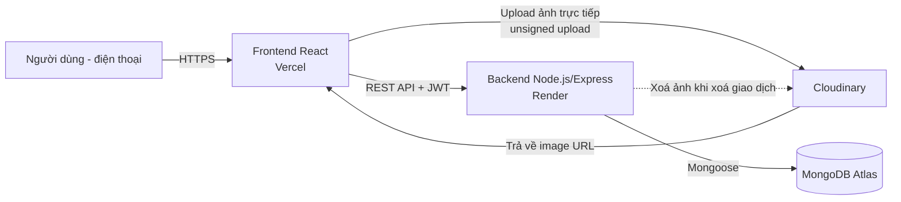
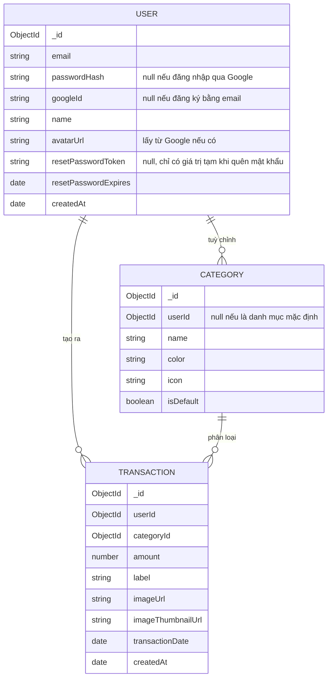

# Tài liệu kỹ thuật — SnapChi (Web App Quản Lý Chi Tiêu Bằng Ảnh)

> Phiên bản 1.0 — Multi-user, React + Node.js, MongoDB, Cloudinary, deploy Vercel + Render (free tier)

---

## 1. Tổng quan

SnapChi là web app quản lý chi tiêu cá nhân, dùng chủ yếu trên điện thoại. Điểm khác biệt: thay vì nhập liệu bằng form, người dùng **chụp ảnh giao dịch** (giống Locket), sau đó nhập số tiền + chọn danh mục. Dữ liệu được xem lại qua **lịch theo ngày trong tháng**, mỗi ngày hiển thị ảnh thu nhỏ đại diện cho các giao dịch.

**Phạm vi bản v1:**
- Đăng ký / đăng nhập bằng email+password **và** Google OAuth
- Chức năng "quên mật khẩu" (gửi email reset)
- Chụp ảnh hoặc chọn ảnh từ thư viện (**mỗi giao dịch chỉ 1 ảnh**) → nhập số tiền, danh mục, ghi chú
- Xem lịch chi tiêu theo tháng, xem chi tiết giao dịch theo ngày
- Sửa / xoá giao dịch
- **Không bao gồm** (để version sau): AI tự nhận diện ảnh để gợi ý danh mục/tên món

---

## 2. Tech stack

| Thành phần | Công nghệ | Ghi chú |
|---|---|---|
| Frontend | React (Vite) | SPA, deploy Vercel |
| Backend | Node.js + Express | REST API, deploy Render |
| Database | MongoDB Atlas (M0 free) | Lưu user, giao dịch, danh mục |
| Lưu trữ ảnh | Cloudinary | Free tier, upload trực tiếp từ frontend |
| Xác thực | JWT (access + refresh token) + Google OAuth 2.0 | Không dùng session vì frontend/backend khác domain |
| Gửi email | Resend (free tier) | Dùng cho email "quên mật khẩu" |
| Deploy frontend | Vercel | Free (Hobby) |
| Deploy backend | Render | Free Web Service |

---

## 3. Cấu trúc thư mục (monorepo)

```
snapchi/
├── backend/
│   ├── src/
│   │   ├── models/          # User, Transaction, Category (Mongoose schema)
│   │   ├── routes/          # auth.routes.js, transactions.routes.js, categories.routes.js
│   │   ├── controllers/
│   │   ├── middlewares/     # auth.middleware.js (verify JWT)
│   │   ├── config/          # db.js, cloudinary.js
│   │   └── app.js
│   ├── package.json
│   └── .env.example
├── frontend/
│   ├── src/
│   │   ├── pages/           # Capture, Confirm, Calendar
│   │   ├── components/
│   │   ├── api/             # axios instance gọi backend
│   │   └── App.jsx
│   ├── package.json
│   └── .env.example
└── README.md
```

Mỗi thư mục (`backend`, `frontend`) là một service riêng khi deploy — Render trỏ vào `backend/`, Vercel trỏ vào `frontend/`.

---

## 4. Kiến trúc hệ thống



**Điểm quan trọng:** ảnh được upload **thẳng từ frontend lên Cloudinary** (không qua backend) bằng unsigned upload preset. Lý do:
- Giảm tải băng thông cho Render (free tier giới hạn bandwidth)
- Nhanh hơn cho người dùng (không phải chờ backend forward file)
- Backend chỉ nhận **URL ảnh** sau khi upload xong, lưu vào MongoDB

---

## 5. Data model (MongoDB)



**Ghi chú thiết kế:**
- Mỗi `Transaction` chỉ gắn **1 ảnh duy nhất** (`imageUrl` là string, không phải mảng) — giữ model đơn giản, đúng tinh thần "chụp nhanh 1 tấm là xong" của app.
- `Category` có sẵn 5 danh mục mặc định (`isDefault: true`, `userId: null`) dùng chung cho mọi user: **Ăn uống, Di chuyển, Giải trí, Hoá đơn, Khác** — cộng thêm danh mục tuỳ chỉnh riêng theo `userId` nếu người dùng muốn thêm.
- `imageThumbnailUrl`: Cloudinary hỗ trợ tạo thumbnail bằng URL transformation (`w_150,h_150,c_fill`) nên **không cần lưu file riêng** — chỉ cần build URL từ `imageUrl` gốc lúc hiển thị.
- Nên đánh index trên `{ userId: 1, transactionDate: 1 }` trong `Transaction` để truy vấn lịch theo tháng nhanh.
- `email` cần unique index; validate format email ở cả FE và BE.
- **Chống IDOR:** mọi query `Transaction`/`Category` theo `_id` ở backend phải luôn kèm điều kiện `userId: req.userId` — không được chỉ tin vào `_id` truyền lên, tránh user A sửa/xoá/đọc được dữ liệu của user B nếu đoán đúng ID.
- Nên bật `{ timestamps: true }` trong Mongoose cho `Transaction` để có sẵn `updatedAt`, biết giao dịch có bị sửa sau khi tạo không.
- **Timezone cần chốt trước khi build lịch:** `transactionDate` lưu dạng `Date` (UTC) nhưng người dùng nghĩ theo "ngày" ở giờ địa phương (VD: giao dịch 23h50 giờ VN ngày 19 lại rơi vào 16h50 UTC cùng ngày 19, nhưng 00h30 giờ VN ngày 20 lại là 17h30 UTC ngày 19) — nếu group theo ngày UTC sẽ sai lệch với cảm nhận người dùng VN. Quyết định 1 trong 2: (a) BE quy đổi theo timezone offset FE gửi kèm, hoặc (b) v1 cố định UTC+7 cho đơn giản.

---

## 6. Xác thực (Authentication)

Vì frontend (Vercel) và backend (Render) nằm ở **domain khác nhau**, dùng cookie session mặc định sẽ gặp vấn đề CORS/SameSite. Khuyến nghị:

- **Access token** (JWT, hết hạn ~15 phút) gửi qua header `Authorization: Bearer <token>`, lưu ở bộ nhớ (React state/context), **không lưu localStorage** để giảm rủi ro XSS.
- **Refresh token** (hết hạn ~30 ngày) lưu trong **httpOnly cookie**, set `SameSite=None; Secure` (bắt buộc vì cross-domain, cả hai domain đều HTTPS nên hợp lệ).
- Endpoint `/api/auth/refresh` dùng để cấp access token mới khi hết hạn.
- Vì access token chỉ ở trong memory, **F5 hoặc mở lại app sẽ mất access token** → frontend cần gọi `/api/auth/refresh` ngay lúc khởi động app (silent refresh) để lấy token mới từ refresh cookie, tránh bắt user đăng nhập lại mỗi lần load trang.
- **Rủi ro Safari/iOS cần test kỹ:** từ Safari 16.4, ITP mặc định chặn nhiều trường hợp cookie cross-site. Vì app dùng chủ yếu trên điện thoại và refresh token phụ thuộc cookie `SameSite=None` cross-domain (Vercel ↔ Render), phải **test thật trên Safari/iOS** trước khi launch — nếu bị chặn, user sẽ bị đăng xuất liên tục dù đăng nhập đúng. Phương án dự phòng nếu gặp vấn đề: dùng subdomain chung cho FE/BE (để cookie thành same-site) hoặc trả refresh token qua response body thay vì cookie.
- **Refresh token rotation:** nên cấp refresh token mới mỗi lần gọi `/api/auth/refresh` và vô hiệu hoá token cũ (lưu hash refresh token hiện hành trong `User` để so khớp) — giảm thiệt hại nếu token bị lộ, đồng thời làm nền cho tính năng "đăng xuất khỏi mọi thiết bị" sau này.
- Mật khẩu hash bằng `bcrypt` (hoặc `argon2`), không bao giờ lưu plaintext.
- CORS backend cần bật `credentials: true` với `origin` cụ thể (không dùng `*`); frontend gọi API phải set `withCredentials: true` (axios) để cookie refresh token được gửi kèm cross-domain.
- Nên thêm rate limiting (vd `express-rate-limit`) cho `/api/auth/login` và `/api/auth/forgot-password` để chống brute-force / spam email.

**Đăng nhập Google OAuth:**
- Dùng thư viện `@react-oauth/google` ở frontend để lấy Google ID token, gửi lên backend.
- Backend xác thực token với Google, tìm user theo `googleId` hoặc `email` — nếu chưa có thì tự tạo user mới (không cần `passwordHash`).
- Sau khi xác thực, backend cấp access + refresh token như luồng đăng nhập thường.

**Quên mật khẩu:**
1. User nhập email tại `/api/auth/forgot-password` → backend tạo `resetPasswordToken` ngẫu nhiên, hết hạn sau ~1 giờ, lưu vào `User`.
2. Backend gửi email (qua Resend) chứa link `https://<frontend>/reset-password?token=...`.
3. User đặt mật khẩu mới tại `/api/auth/reset-password`, backend kiểm tra token còn hạn, cập nhật `passwordHash`, xoá token.
4. Tài khoản đăng nhập bằng Google (không có `passwordHash`) sẽ không hiển thị lựa chọn "quên mật khẩu".

**Middleware backend:** kiểm tra JWT ở mọi route trừ `/api/auth/*`, gắn `req.userId` để các controller lọc dữ liệu theo đúng user.

---

## 7. API endpoints

| Method | Endpoint | Mô tả |
|---|---|---|
| POST | `/api/auth/register` | Đăng ký (email, password, name) |
| POST | `/api/auth/login` | Đăng nhập, trả access token + set refresh cookie |
| POST | `/api/auth/google` | Đăng nhập/đăng ký qua Google ID token |
| POST | `/api/auth/forgot-password` | Gửi email chứa link reset mật khẩu |
| POST | `/api/auth/reset-password` | Đặt mật khẩu mới bằng token từ email |
| POST | `/api/auth/refresh` | Cấp access token mới từ refresh cookie |
| POST | `/api/auth/logout` | Xoá refresh cookie |
| GET | `/api/categories` | Danh sách danh mục (mặc định + tuỳ chỉnh của user) |
| POST | `/api/categories` | Tạo danh mục tuỳ chỉnh |
| DELETE | `/api/categories/:id` | Xoá danh mục tuỳ chỉnh |
| GET | `/api/transactions/calendar?month=&year=` | Trả về giao dịch nhóm theo ngày trong tháng (dùng cho lịch) |
| GET | `/api/transactions/day?date=` | Danh sách giao dịch của 1 ngày cụ thể |
| POST | `/api/transactions` | Tạo giao dịch (amount, categoryId, label, imageUrl, transactionDate) |
| PUT | `/api/transactions/:id` | Sửa giao dịch |
| DELETE | `/api/transactions/:id` | Xoá giao dịch (kèm xoá ảnh trên Cloudinary) |

---

## 8. Luồng upload ảnh (Cloudinary)

1. Frontend tạo **unsigned upload preset** trên Cloudinary dashboard (giới hạn folder, kích thước file, định dạng).
2. Người dùng chụp ảnh → frontend gọi thẳng `https://api.cloudinary.com/v1_1/<cloud_name>/image/upload` kèm preset, **không cần secret key** ở phía client.
3. Cloudinary trả về `secure_url` + `public_id` → frontend gửi kèm trong request `POST /api/transactions`.
4. Khi xoá giao dịch, backend gọi Cloudinary Admin API (dùng API secret, chỉ có ở backend) để xoá ảnh theo `public_id`, tránh rác ảnh tồn đọng chiếm quota free.
5. **Validate `imageUrl` ở backend trước khi lưu:** vì FE gửi thẳng URL trong `POST /api/transactions`, BE nên kiểm tra URL đúng định dạng `https://res.cloudinary.com/<cloud_name>/...` với đúng `cloud_name` cấu hình — tránh client gửi URL bất kỳ (kể cả không phải ảnh, hoặc độc hại) vào trường này.
6. **Rủi ro lạm dụng unsigned preset:** `cloud_name` + tên preset lộ công khai trong bundle FE, nên về lý thuyết ai cũng gọi thẳng được Cloudinary API để upload vào preset đó, tốn quota free ngoài ý muốn. Giảm thiểu bằng cách giới hạn preset (max file size, chỉ cho phép định dạng ảnh, giới hạn folder); nếu lo ngại nghiêm trọng, cân nhắc chuyển sang **signed upload** (ký bởi backend) ở version sau.

---

## 9. Deploy

### Frontend → Vercel
- Import repo, chọn root directory `frontend/`
- Build command: `npm run build`, Output: `dist/`
- Biến môi trường: `VITE_API_URL` (trỏ tới URL backend Render), `VITE_CLOUDINARY_CLOUD_NAME`, `VITE_CLOUDINARY_UPLOAD_PRESET`, `VITE_GOOGLE_CLIENT_ID`

### Backend → Render
- New Web Service, root directory `backend/`
- Build command: `npm install`, Start command: `node src/app.js`
- Biến môi trường: `MONGODB_URI`, `JWT_SECRET`, `JWT_REFRESH_SECRET`, `CLOUDINARY_API_KEY`, `CLOUDINARY_API_SECRET`, `CLOUDINARY_CLOUD_NAME`, `CORS_ORIGIN` (URL frontend Vercel), `GOOGLE_CLIENT_ID`, `GOOGLE_CLIENT_SECRET`, `RESEND_API_KEY`

### Database → MongoDB Atlas
- Tạo cluster free (M0), whitelist IP `0.0.0.0/0` (Render free không có IP tĩnh) hoặc dùng Network Access tạm thời mở rộng.

---

## 10. Giới hạn gói free — cần lưu ý khi triển khai

| Dịch vụ | Giới hạn free | Ảnh hưởng thực tế |
|---|---|---|
| **Render** (Web Service) | ~750 giờ instance/tháng, ~100GB bandwidth, tự **sleep sau ~15 phút không hoạt động** | Lần request đầu sau khi sleep sẽ mất **30–50 giây** để "thức dậy" — nên có loading state rõ ràng ở frontend cho lần gọi API đầu tiên |
| **MongoDB Atlas M0** | 512MB storage | Với app cá nhân/nhóm nhỏ dùng lâu dài vẫn ổn, nhưng nên theo dõi khi user tăng |
| **Cloudinary** | 25 credit/tháng (1 credit = 1.000 lượt transform, HOẶC 1GB lưu trữ, HOẶC 1GB băng thông) | Nên **nén/resize ảnh phía frontend trước khi upload** (vd giới hạn 1200px chiều dài) để tiết kiệm storage và bandwidth cùng lúc |
| **Vercel** (Hobby) | Đủ dùng cho frontend cá nhân, có giới hạn băng thông/tháng | Thường không phải vấn đề với app quy mô nhỏ |

*Lưu ý: các con số trên có thể thay đổi theo thời gian — nên kiểm tra lại trang pricing chính thức của từng dịch vụ trước khi launch chính thức.*

---

## 11. Roadmap (tính năng tương lai)

- **AI nhận diện ảnh**: dùng model vision để gợi ý danh mục/tên món ngay khi chụp ảnh, người dùng chỉ cần xác nhận thay vì gõ tay.
- **Tự động dọn ảnh cũ**: xây cron job (chạy định kỳ, ví dụ 1 lần/tuần) tự xoá ảnh trên Cloudinary của các giao dịch cũ hơn X tháng (X cụ thể quyết định sau), giữ lại dữ liệu số tiền/danh mục/ngày trong MongoDB, chỉ xoá phần ảnh để tiết kiệm quota lưu trữ. **Ghi chú: v1 chưa làm ngay, nhưng cần nhớ quay lại làm khi gần chạm giới hạn free tier Cloudinary (25 credit/tháng).**
- Đặt ngân sách (budget) theo danh mục + cảnh báo khi vượt.
- Xuất báo cáo/biểu đồ theo tháng.
- Thông báo nhắc nhở nếu quên ghi chi tiêu trong ngày.

---

## 12. Câu hỏi còn mở — cần quyết định thêm

- [ ] Domain gửi email reset mật khẩu: dùng domain riêng đã verify trên Resend, hay tạm dùng domain test mặc định của Resend (giới hạn chỉ gửi được tới email của chính bạn ở giai đoạn free/chưa verify)?
- [ ] X tháng cụ thể cho việc tự xoá ảnh cũ ở mục Roadmap là bao nhiêu? (quyết định sau, khi gần build tính năng đó)
- [ ] Xử lý timezone cho `transactionDate`/lịch theo ngày: quy đổi theo offset FE gửi lên, hay cố định UTC+7 cho v1? (xem mục 5)
- [ ] Có cần refresh token rotation + khả năng "đăng xuất khỏi mọi thiết bị" ngay từ v1, hay để version sau? (xem mục 6)
